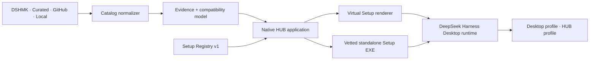

<p align="center">
  
</p>

<h1 align="center">DeepSeek Harness HUB</h1>

<p align="center">
  <strong>Everything is a Setup.</strong><br />
  Discover, understand, install, update, repair, and compose the DeepSeek Harness ecosystem from one desktop-native control center.
</p>

<p align="center">
  <a href="README.zh-CN.md">简体中文</a> ·
  <a href="https://github.com/Iraryi/deepseek-harness-hub/releases">Downloads</a> ·
  <a href="docs/hub/setup-package-spec.md">Setup specification</a> ·
  <a href="CONTRIBUTING.md">Contributing</a>
</p>

<p align="center">
  
  
  
  
</p>

> [!IMPORTANT]
> This is an independent community distribution and ecosystem project. DeepSeek Harness itself is developed in the upstream [`deepseek-ai/deepseek-harness`](https://github.com/deepseek-ai/deepseek-harness) repository.

## One HUB, three layers

| Layer | What users see | What it does |
| --- | --- | --- |
| **HUB application** | A native desktop marketplace and component manager | Aggregates DSHMK, curated sources, GitHub discovery, starred projects, local packages, installed components, updates, repair, and restart workflows |
| **Setup registry** | Consistent Setup-style installation pages | Describes source, license, publisher, certificate/signature state, permissions, network use, install evidence, options, rollback, and compatibility before installation |
| **HUB distribution** | HUB Setup, HUB Runtime, and developer builds | Provides the independent Windows WebView2 host, HUB CONFIG, private Node.js runtime, and offline recovery |

The HUB does **not** claim that arbitrary GitHub source can safely become an EXE. Online entries are rendered as **virtual Setup experiences** backed by inspectable recipes. Standalone Setup EXEs belong to the curated library and are accepted only after repeatable installation, launch, update, and uninstall checks.

## Download

The current Windows assets are published on the [Releases page](https://github.com/Iraryi/deepseek-harness-hub/releases).

| Asset | Best for | Network requirement |
| --- | --- | --- |
| **Full Setup** | First-time users and unreliable networks | Can install the bundled Runtime and WebView2 offline |
| **Lite Setup** | Smaller initial download | Downloads a verified Runtime, or imports a manually downloaded Runtime ZIP |
| **Portable ZIP** | Evaluation and removable storage | Requires WebView2 already installed |
| **Runtime ZIP** | Repair, offline transfer, and Lite Setup import | No installer UI by itself |

## Product experience

- **Native HUB process** — separate taskbar identity, icon, window lifecycle, and restart behavior from the main Desktop application.
- **Evidence-rich details** — source, release/ref, license, certificate state, validation result, install guide, permissions, dependencies, and expected file changes.
- **One-click Setup where possible** — deterministic recipes for recognized packages; manual download/import remains available when a network route is unreliable.
- **Honest fallbacks** — unsupported or ambiguous projects open an assisted Setup flow instead of pretending the install succeeded.
- **Local ownership** — installed, prepared, offline, starred, and locally-authored packages remain distinct collections.
- **Composable editing** — generated edit paths and manifests make it practical to hand a component to an AI or developer without mixing it into discovery.

## Architecture



Read the full [architecture guide](docs/architecture.md) and [desktop distribution boundary](docs/desktop-distribution.md).

## Repository map

```text
.
├─ apps/                     DSH command and application entry points
├─ packages/                 HUB Web UI, Setup protocol, registry, and shared DSH packages
├─ windows/                  Native HUB host, Runtime, Setup builder, and release assembly
├─ registry/                 Public first-party Setup catalog and JSON Schema
├─ examples/setup-package/   Minimal authoring example
├─ examples/setup-workspace/ Editable source/build/component workspace example
├─ snapshots/                Full-screen bilingual development snapshots
├─ docs/                     Architecture, catalog, release, and package specifications
├─ scripts/                  Dependency-free repository validation
└─ .github/                  CI, issue forms, pull request policy, and release notes config
```

The HUB implementation is the root project in this repository. The native host, Runtime, Setup builder, Web UI, Setup protocol, catalog adapters, tests, and all shared DSH packages are directly editable here. See the [source map](docs/hub/source-layout.md) for the exact customization points. `deepseek-harness-desktop` is a separate Desktop distribution and is not the HUB source or release center.

## Build HUB from source

```powershell
npm run build:hub
```

The build entry checks Node.js, pnpm, and WebView2 SDK prerequisites and writes results to the repository-level `dist/` directory. Contributors can work directly in the root pnpm workspace and modify the native host, Runtime, Setup builder, or Web UI without crossing into another repository.

## Publish a Setup

1. Read the [Setup package specification](docs/hub/setup-package-spec.md).
2. Start from [`examples/setup-package/manifest.json`](examples/setup-package/manifest.json).
   For editable local or AI-assisted builds, also read [Custom Setup Workspaces](docs/hub/custom-workspaces.md) and start from [`examples/setup-workspace/manifest.json`](examples/setup-workspace/manifest.json).
3. Run `npm run validate` locally.
4. Open a **Setup submission** issue with installation evidence.
5. Submit a pull request after the package has stable install and uninstall behavior.

Standalone EXEs additionally require hashes, publisher information, privilege declaration, a clean-machine install log, launch evidence, update behavior, and uninstall residue notes.

## Status

The project is in an early release-candidate stage. Registry v1 is intentionally conservative: its data model is stable enough for tooling, while catalog contents and desktop UX continue to evolve quickly.

## License

Code and first-party specifications are released under the permissive [MIT License](LICENSE). Third-party packages keep their own licenses; catalog inclusion never changes upstream ownership or licensing.
