# DeepSeek Harness Desktop：新手从 GitHub 下载 Setup 后的完整体验

> 用途：作为产品介绍动画、UI 演示视频、AI 视频生成或自动化分镜的基础说明。
>
> 当前画面参考：`snapshots/zh-CN/setup/`、`snapshots/zh-CN/config/`、`snapshots/zh-CN/hub/`。
>
> 所有参考快照均为 **2560 × 1600**。动画应保持完整窗口，不裁掉标题栏、底部按钮、滚动区域或弹窗。

## 1. 核心叙事

这不是一段“开发者打开终端、安装 Node.js、输入命令”的故事，而是一段普通 Windows 用户完成正式桌面软件安装的故事。

主角是一位不熟悉 Git、Node.js、pnpm、端口或 WebView2 的普通用户。他只做三件事：

1. 从 GitHub Release 下载一个 Setup EXE。
2. 保持推荐设置，一路点击“下一步”和“安装”。
3. 在首次启动的 CONFIG 中完成个性化设置，然后进入主程序。

产品要传达的核心信息是：

- 电脑即使没有 Node.js、pnpm、Git 或开发环境，也能直接安装。
- Setup 会自动检查 Windows、安装位置、磁盘空间、WebView2 和应用 Runtime。
- Full Setup 可以离线安装核心 Runtime；Lite Setup 可以在线下载并校验 Runtime。
- 安装失败不会假装成功，也不会用不完整 Runtime 覆盖已有可用版本。
- 首次进入主程序前，用户可以在独立 CONFIG 中选择语言、分辨率、全屏方式、加载画面和托盘行为。
- 最终运行的是独立 WebView2 桌面应用，不需要依附外部浏览器窗口。

## 2. 动画规格建议

- **源画布**：2560 × 1600，16:10。
- **如需导出 16:9**：完整缩放 16:10 画面，并用背景延展或柔和留边适配；禁止直接裁切上下区域。
- **建议时长**：主版本 90～120 秒；精简版本 45～60 秒。
- **帧率**：60 FPS，鼠标和窗口动画必须平滑。
- **镜头语言**：以完整桌面和完整程序窗口为主，必要时使用轻微推近，不使用突然放大、画面撕裂或窗口瞬间变形。
- **鼠标轨迹**：使用缓入缓出曲线；点击前短暂停留 0.2～0.4 秒；按钮按下应有轻微反馈。
- **转场**：页面切换采用短暂交叉淡化或内容平滑替换，窗口外框和尺寸保持稳定。
- **整体气质**：可靠、清晰、轻量、友好；不是黑客工具宣传片，也不是终端命令演示。

## 3. 默认新手路线总览

```mermaid
flowchart LR
    A[GitHub Release 下载完成] --> B[双击 Setup EXE]
    B --> C[语言与许可]
    C --> D[推荐安装]
    D --> E[开始菜单与桌面快捷方式]
    E --> F[电脑检查]
    F --> G[确认安装内容]
    G --> H[准备与安装]
    H --> I[安装完成]
    I --> J[首次打开 CONFIG]
    J --> K[保存并启动]
    K --> L[双鲸加载画面]
    L --> M[DeepSeek Harness 主界面]
```

## 4. 逐镜头完整分镜

### 镜头 01：GitHub 下载完成

**画面**

- GitHub Release 页面位于浏览器中。
- 下载栏或 Windows“下载”文件夹中出现 Setup EXE。
- 文件名可表现为：`DeepSeek-Harness-Setup-Full-<版本>-win-x64.exe`。
- 用轻微高亮强调 `Full`、`win-x64` 和 Setup 图标。

**用户动作**

- 用户双击 Setup EXE。

**旁白建议**

> 下载一个 Setup，就可以从零开始安装。电脑不需要提前准备 Node.js、pnpm、Git 或开发环境。

**注意**

- 不要让用户解压源码 ZIP。
- 不要出现命令提示符、PowerShell 或 Node.js 工作目录选择框。
- Windows SmartScreen 只作为可选系统分支：若安装包尚未积累信誉，可能出现系统确认；不要把它表现为产品内部页面。
- 默认安装位置位于当前用户目录，因此通常不要求管理员权限；只有 Windows 安装系统组件时，才可能按系统策略短暂请求授权。

### 镜头 02：安装语言

**画面**

- 如果 Windows 尚未保存过安装语言，先出现简洁的语言选择。
- 提供简体中文和 English。
- 用户选择“简体中文”。

**行为说明**

- 安装器会记住上次使用的安装语言。
- 如果已有记录，未来升级可能直接沿用语言并跳过该选择。

### 镜头 03：欢迎页面

**参考画面**：`snapshots/zh-CN/setup/01-welcome.png`

**画面**

- 完整显示标题栏“安装 - DeepSeek Harness”。
- 左侧是浅蓝色安装插图。
- 主标题为“欢迎使用 DeepSeek Harness”。
- 正文明确说明：安装包可以直接用于没有 Node.js 或开发工具的电脑。
- 右下角显示“下一步”和“取消”。

**用户动作**

- 鼠标平滑移动到“下一步”，点击。

**旁白建议**

> 保持推荐选项，安装器会检查电脑、安装完整本体、补齐 WebView2，并在升级时保留已有用户数据。

### 镜头 04：开源许可

**参考画面**：`snapshots/zh-CN/setup/02-license.png`

**画面**

- 显示项目许可证全文。
- 用户快速浏览，不需要逐行滚动到底。
- 镜头可短暂强调“开源”“许可声明”“第三方声明”等概念。

**用户动作**

- 接受许可并点击“下一步”。

**动画目的**

- 让观众意识到这是公开源码、带许可证和第三方声明的正式安装流程。
- 不要把许可证页面处理成一闪而过的无意义灰框。

### 镜头 05：选择安装方式

**参考画面**：`snapshots/zh-CN/setup/03-installation-method.png`

**画面**

- 第一项默认选中：**推荐安装——自动安装全部必需内容**。
- 第二项：**高级选项——自定义数据位置或 Runtime 来源**。
- 页面说明 DeepSeek Harness 自带私有 Node.js，并会在需要时自动安装 WebView2。

**默认新手动作**

- 不修改选项，直接点击“下一步”。

**旁白建议**

> 推荐安装会自动决定程序位置、数据位置和 Runtime 来源。普通用户不需要理解这些组件。

**动画处理**

- 主线继续走推荐安装。
- 高级选项只在画面侧边短暂展开为“可选分支”，随后收回，不打断主线。

### 镜头 06：高级选项分支——安装位置

**参考画面**：`snapshots/zh-CN/setup/04-install-location.png`

**默认行为**

- 推荐安装会跳过这个页面。
- 默认安装位置为：`%LOCALAPPDATA%\Programs\DeepSeek Harness`。
- 这是当前用户可写的位置，通常不需要管理员权限。

**高级用户可见内容**

- 可以选择其他程序目录。
- 如果目录不可写，后续电脑检查会明确标记“需要处理”。

### 镜头 07：高级选项分支——应用数据

**参考画面**：`snapshots/zh-CN/setup/05-application-data.png`

**两个选项**

1. **标准数据模式（推荐）**：设置、日志和浏览器数据保存到 `%LOCALAPPDATA%\DeepSeekHarness`。
2. **便携数据模式**：数据保存在程序目录旁的 `data` 文件夹中，卸载时仍保留。

**动画表达**

- 用两个简洁文件夹图示表示“用户目录”和“程序旁边”。
- 强调 Desktop、HUB、CONFIG 的设置和运行数据不会被粗暴塞进 EXE 本身。

### 镜头 08：高级选项分支——Runtime 来源

**参考画面**：`snapshots/zh-CN/setup/06-runtime-source.png`

**Full Setup 中的选择**

- 使用安装包内置 Runtime：离线、推荐。
- 导入本地 Runtime ZIP。
- 复制已有 Runtime 文件夹。
- 从 GitHub 源码 ZIP 本地构建：高级方式，需要 Node.js 22.19+ 和 pnpm。

**Lite Setup 中的差异**

- 默认从 GitHub 下载经过校验的 Runtime。
- 下载完成后会验证固定的 SHA-256，不能把未知文件直接当作 Runtime 使用。

**主线表达**

- Full Setup 选择“内置 Runtime”，网络图标淡出，突出离线可用。
- Lite Setup 可以作为一个短暂的平行镜头：GitHub 云端向本地传输 Runtime，随后出现“校验通过”。

### 镜头 09：本地来源的三个可选页面

**参考画面**

- `snapshots/zh-CN/setup/07-local-runtime-zip.png`
- `snapshots/zh-CN/setup/08-existing-runtime-folder.png`
- `snapshots/zh-CN/setup/09-source-zip-build.png`

**行为**

- 选择本地 Runtime ZIP 时，必须指定一个真实存在的 ZIP。
- 选择已有 Runtime 文件夹时，该目录需要包含 Runtime 清单、私有 Node.js 和打包后的程序文件。
- 选择源码 ZIP 本地构建时，安装器会检查系统 Node.js 与 pnpm；缺少工具时不会继续假装安装。

**失败反馈**

- 文件或目录不存在：立即出现明确错误提示，并停留在当前页面。
- 源码构建工具缺失：电脑检查中标记“需要处理”，同时提供“恢复推荐设置”。

### 镜头 10：开始菜单文件夹

**参考画面**：`snapshots/zh-CN/setup/09a-start-menu-folder.png`

**画面**

- 默认开始菜单组为“DeepSeek Harness”。
- 安装后开始菜单中会有三个独立入口：
  - DeepSeek Harness
  - DSH HUB
  - DeepSeek Harness CONFIG

**产品意义**

- 主程序、HUB 和 CONFIG 是相互关联但可以独立启动的程序。
- 不要把 HUB 画成主程序里的网页标签页。

### 镜头 11：附加任务

**参考画面**：`snapshots/zh-CN/setup/09b-additional-tasks.png`

**画面**

- 提供“创建桌面快捷方式”等附加任务。
- 用户可以勾选或保持默认。

**动画建议**

- 轻轻勾选桌面快捷方式，桌面角落出现 DeepSeek Harness 图标的预览，但不要提前真正启动程序。

### 镜头 12：电脑检查

**参考画面**：`snapshots/zh-CN/setup/10-computer-check.png`

这是 Setup 最重要的信任建立页面之一，应给足 5～8 秒展示时间。

**六类检查项**

1. **系统与运行环境**：Windows 版本和 x64 架构是否支持；私有 Node.js 是否随安装包提供。
2. **程序安装位置**：目标目录是否可写。
3. **用户数据**：标准或便携数据目录是否可写。
4. **磁盘空间**：显示可用空间和安装期间可能临时使用的空间。
5. **内嵌网页界面**：WebView2 已就绪，或安装程序会自动补齐。
6. **应用本体**：Runtime 已内置、将在线下载，或将从本地来源导入并校验。

**状态颜色**

- `[通过]`：绿色。
- `[自动处理]`：蓝色或中性强调色。
- `[需要处理]`：红色，但不要使用闪烁警报。

**交互按钮**

- “重新检查”：修复外部问题后再次检查。
- “显示技术细节”：展开更具体的路径和检查日志。
- “恢复推荐设置”：高级设置不可用时，一键回到可安装路线。

**升级场景**

- 如果检测到已有安装，页面会说明：安装器将关闭相关进程、升级程序文件并保留用户数据。
- 如果没有已有安装，则显示将执行全新安装。

### 镜头 13：准备安装

**参考画面**：`snapshots/zh-CN/setup/11-ready-to-install.png`

**画面**

- 以摘要形式列出：
  - 目标位置
  - 安装方式
  - 数据模式
  - Runtime 来源
  - WebView2 状态
  - 开始菜单与桌面快捷方式
- 底部按钮从“下一步”变为“安装”。

**用户动作**

- 用户短暂停留确认，然后点击“安装”。

**在线下载分支**

- 如果 Lite Setup 需要下载 Runtime，此时进入下载与校验页面。
- 下载失败时明确提示检查网络并重试；用户也可以返回高级选项，改用提前下载好的 Runtime ZIP。
- 不要表现成无限转圈或没有反馈的灰色窗口。

### 镜头 14：五阶段准备流程

**参考画面**：`snapshots/zh-CN/setup/12-preparation.png`

**页面行为**

- 显示总进度条。
- 同时显示“第 X/5 步”和当前动作，不让用户面对静止页面猜测发生了什么。

**五个阶段**

1. 关闭正在运行的 DeepSeek Harness、DSH HUB、CONFIG、私有 Node.js 和相关 WebView2 进程。
2. 检查并准备 Microsoft Edge WebView2；缺失时自动安装。
3. 校验并安装 DeepSeek Harness Runtime；这一阶段可能持续数分钟。
4. 写入首次使用配置，但不覆盖已有用户配置。
5. 完成安装完整性检查。

**可靠性表达**

- 如果 Runtime 安装失败，已有 Runtime 会被保留。
- Setup 不接受“不完整但显示成功”的结果；失败后回到可以修复和重试的状态。

### 镜头 15：复制程序文件

**参考画面**：`snapshots/zh-CN/setup/13-installing.png`

**画面**

- 标题变为“正在安装”。
- 进度条继续向前。
- 复制并注册三个主要入口：主程序、HUB、CONFIG。
- 建立开始菜单快捷方式，并按用户选择建立桌面快捷方式。

**动画建议**

- 不要让这一页突然只出现一瞬间。
- 让进度条平滑完成，并用轻微的文件卡片动画表示组件落位。

### 镜头 16：安装完成

**参考画面**：`snapshots/zh-CN/setup/14-finished.png`

**画面**

- 标题：“完成 DeepSeek Harness 安装向导”。
- 明确说明首次启动会先打开 CONFIG。
- 提示用户可以设置语言、窗口大小、全屏方式、加载画面、托盘行为和扩展。
- 默认保留“启动 DeepSeek Harness”选项。

**用户动作**

- 点击“完成”。
- Setup 窗口平滑淡出，不留下命令行窗口。

## 5. 首次启动 CONFIG

安装结束后，主程序不会直接把用户丢进尚未适配的界面，而是先启动独立 CONFIG。

### 镜头 17：CONFIG 语言选择

**参考画面**：`snapshots/zh-CN/config/00-language-selection.png`

**画面**

- CONFIG 完整界面已经出现，其上方居中显示语言选择弹窗。
- 用户选择简体中文或 English。
- 此语言是 Desktop/CONFIG 的运行语言设置，不应与安装器语言选择混为一谈。

### 镜头 18：显示与窗口模式

**参考画面**：`snapshots/zh-CN/config/01-display.png`

**用户可设置**

- 宽高比预设，例如 16:9、16:10。
- 对应的常用分辨率预设。
- 更下级的自定义宽度和高度。
- 默认启动形式：
  - 窗口
  - 带边框全屏
  - 无边框全屏
  - 独占全屏
- 全屏时是否保留应用工具栏。
- 无边框或独占全屏时是否保留 Windows 任务栏。
- 工具栏与全屏快捷键。

**默认值**

- 首次配置以 1280 × 800 窗口模式作为安全起点。
- 动画中可以演示用户选择与当前显示器一致的 2560 × 1600，并选择窗口或无边框全屏。

### 镜头 19：加载画面与关闭行为

**可选加载画面**

- **双鲸动画**：两只鲸鱼围绕中心追逐彼此尾巴，作为默认加载风格。
- **进度控制台**：高级进度条、百分比和阶段文字。
- **关闭**：不显示原生加载画面。

**关闭行为**

- 默认点击标题栏 X 时最小化到系统托盘，让本地服务继续运行。
- 也可以改为完全退出应用并停止服务。
- 当 X 被设置为完全退出时，可以保留一个专门的“最小化到托盘”按钮。

### 镜头 20：服务与开发选项

**参考画面**

- `snapshots/zh-CN/config/02-server.png`
- `snapshots/zh-CN/config/03-extensions-and-dev.png`

**服务页面**

- 本地 Web UI 地址，默认 `http://127.0.0.1:3080`。
- 端口，默认 `3080`。
- 私有 `node.exe` 和 Harness 目录；路径留空时使用自动检测。

**扩展与开发页面**

- 加载未打包的 Edge/Chrome 扩展。
- 注入自定义 CSS 或 JavaScript，为后续 Web UI 二次开发保留入口。
- 开发者工具和外部链接行为。

### 镜头 21：Desktop 与 HUB 配置切换

**参考画面**

- `snapshots/zh-CN/config/04-desktop-target-switcher.png`
- `snapshots/zh-CN/config/05-hub-appearance.png`
- `snapshots/zh-CN/config/06-hub-startup.png`
- `snapshots/zh-CN/config/07-hub-target-switcher.png`

**行为**

- 左上角目标选择器可以在“DeepSeek Harness”和“DSH HUB”之间展开切换。
- 两套配置互相独立，不会因为修改 HUB 深色模式而改变主程序。

**HUB 外观**

- 跟随 Windows、浅色或深色主题。

**HUB 启动**

- 默认主页。
- 默认发现源。
- 每页项目数量。
- 项目详情打开方式。
- HUB 自己的加载画面和关闭行为。
- Desktop 插件默认不影响 HUB；只有用户主动允许时才共享。

### 镜头 22：保存并启动

**画面**

- CONFIG 底部提供“保存”“保存并启动”“取消”。
- 用户点击蓝色主按钮“保存并启动”。
- CONFIG 平滑关闭，主程序作为独立进程启动。

## 6. 主程序第一次加载

### 镜头 23：双鲸加载画面

**默认画面**

- 深色或浅色的简洁背景。
- 中央是两只鲸鱼围绕中心顺滑旋转，形成首尾追逐的视觉循环。
- 不应出现白屏、浏览器错误页或外部 Edge 网站。

**内部真实阶段可用于进度控制台字幕**

- 准备 Runtime。
- 协调本地服务启动。
- 启动私有 Node.js 服务。
- 初始化 WebView2 浏览器引擎。
- 启动本地 Web UI。
- 等待本地服务响应。
- 连接 Web UI。
- 完成插件图谱。
- 激活 Web UI 插件。
- 渲染正式界面。

**动画要求**

- 进度只能向前，不来回跳动。
- 阶段文本使用淡入淡出，不要造成整屏震动。
- 正式界面准备好后，加载层整体轻微缩放并淡出，底层界面一次性稳定出现。

### 镜头 24：进入 DeepSeek Harness Desktop

**画面**

- 显示完整主界面，而不是浏览器窗口套浏览器窗口。
- Web UI 位于 WebView2 原生桌面外壳中。
- 标题栏、工具栏和任务栏状态遵循 CONFIG 设置。
- 界面按照设定分辨率出现，不在切换瞬间改变窗口尺寸。

**系统托盘**

- 默认点击 X 后应用最小化到托盘，本地服务继续运行。
- 再次启动主程序时，如果已有实例运行，应唤醒已有窗口或给出清晰提醒，而不是重复创建 Node.js 服务。

## 7. DSH HUB 的首次发现

主程序已经可用后，动画可以用最后 10～15 秒介绍 HUB，但不要让 HUB 抢走 Setup 主线。

**进入方式**

- 开始菜单中的“DSH HUB”。
- 主程序托盘或右键菜单中的“打开 HUB”。
- HUB 是独立进程，有自己的任务栏入口、托盘入口和 HUB 图标。

**HUB 首屏可展示**

- 主页：自己的 Setup 库、离线包、收藏、已安装组件。
- DSHMK、精选市场和 GitHub 发现源。
- 分类、筛选、搜索、项目详情和一键 Setup。
- 安装前显示来源、许可证、声明、验证状态和安装参考。

**结尾旁白建议**

> 从一个 Setup 开始，得到的不只是桌面入口，而是一套可以安装、配置、扩展和管理整个 DSH 生态的工作环境。

## 8. 异常与恢复镜头

这些镜头适合作为短暂蒙太奇，不要占据主宣传片的大部分时间。

### 网络不可用

- Full Setup 的内置 Runtime 路线仍可继续。
- Lite Setup 下载失败时显示明确错误，不无限旋转。
- 用户可以重试，或返回高级选项导入本地 Runtime ZIP。

### WebView2 缺失

- 电脑检查显示“自动处理”。
- Full Setup 使用内置微软离线安装器。
- Lite Setup 使用微软在线安装器，需要网络。

### 磁盘空间不足或目录不可写

- 电脑检查显示红色“需要处理”。
- “下一步”不能绕过失败检查。
- 用户修改位置或释放空间后点击“重新检查”。

### 已有版本正在运行

- Setup 在准备阶段关闭主程序、HUB、CONFIG、私有 Node.js 和相关 WebView2 进程。
- 若无法关闭，明确要求用户完全退出后重试。
- 升级保留用户数据和可用 Runtime，不把旧版本粗暴删除后留下空壳。

### 安装中途失败

- 显示失败阶段和技术日志位置。
- 不出现“失败但完成”的矛盾页面。
- 用户修复问题后可以再次点击“安装”。

## 9. 动画 AI 必须避免的错误

- 不要把 Setup 画成网页。
- 不要把 DeepSeek Harness Desktop 画成外部 Edge 浏览器标签页。
- 不要出现安装期间自动打开 Microsoft WebView2 宣传网站。
- 不要出现系统 Node.js 的工作目录选择弹窗。
- 不要表现为每启动一次就创建永久残留的 Node.js 进程。
- 不要裁掉底部“上一步 / 下一步 / 安装 / 完成”按钮。
- 不要让窗口在页面切换时改变尺寸。
- 不要使用闪烁选项、撕裂转场、文字重叠、半截文字或无法滚动的区域。
- 不要让进度条最后一瞬间才突然出现。
- 不要把高级源码 ZIP 构建路线当作普通用户默认路线。
- 不要把 Desktop 插件默认注入 HUB。
- 不要把 HUB 和主程序合并成同一个进程或同一个图标。
- 不要展示任何真实 Token、GitHub 密钥、用户隐私路径或个人文件内容。

## 10. 60 秒精简版旁白稿

> 从 GitHub 下载一个 DeepSeek Harness Setup，就能在一台没有 Node.js、pnpm、Git 或开发环境的 Windows 电脑上直接开始。
>
> 保持推荐安装，Setup 会自动选择用户可写的程序和数据位置，提供私有 Node.js Runtime，并在需要时补齐 Microsoft Edge WebView2。
>
> 安装前，电脑检查会验证系统、目录、磁盘空间、WebView2 和应用本体。只有全部检查通过，安装才会继续。
>
> 准备阶段会安全关闭旧进程、校验 Runtime、准备首次配置，并拒绝任何不完整安装。
>
> 安装完成后，首次启动先进入独立 CONFIG。你可以选择语言、分辨率、窗口与全屏模式、双鲸加载画面、托盘行为、快捷键以及扩展与 Web UI 二次开发入口。
>
> 保存并启动，双鲸加载动画覆盖本地服务和 WebView2 的初始化过程。正式界面准备完成后，DeepSeek Harness Desktop 稳定出现，不依赖外部浏览器。
>
> 需要更多能力时，独立的 DSH HUB 提供插件发现、验证、详情、一键 Setup、本地包和已安装组件管理。
>
> 一个 Setup，完成安装、配置、运行与整个 DSH 生态的入口。

## 11. 推荐结尾画面

1. DeepSeek Harness Desktop 稳定显示在前景。
2. DSH HUB 从侧后方平滑出现，但保持独立窗口和独立图标。
3. CONFIG 以较小的第三张卡片形式出现，形成 Desktop、HUB、CONFIG 三个明确入口。
4. 三张卡片下方出现一句话：

> **Everything is a Setup. 从零安装，到无限扩展。**

5. 最后显示 GitHub 仓库名称和 Release 下载入口，不展示浏览器地址栏中的个人信息。
